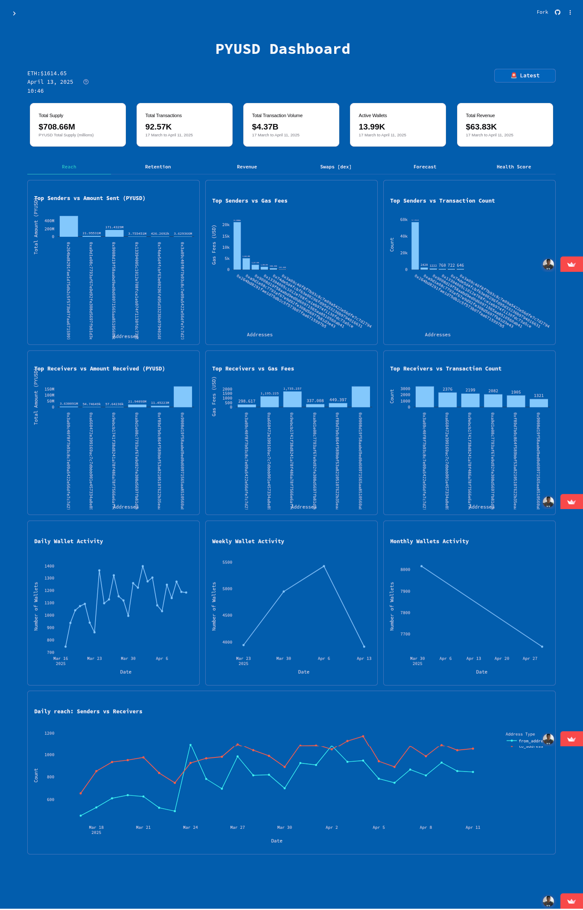

# PYUSD On-Chain Analytics Dashboard

* **[Live Demo](https://pyusd-dashboard.streamlit.app/)**
* **[Dashboard Link](https://pyusd-dashboard.streamlit.app/)**
* PYUSD Dashboard Screenshot


## Overview

**PYUSD On-Chain Analytics Dashboard** is a Python-based application leveraging Google Cloud's Blockchain Node Service to provide deep, real-time insights into PYUSD (Paxos-issued PayPal USD) activities and transactions on the Ethereum network.

**Problem Solved:** This project addresses the need for accessible and detailed on-chain analytics specifically for PYUSD. While blockchain explorers exist, they often lack tailored metrics or utilize computationally expensive methods sparingly due to cost. This dashboard makes advanced transaction analysis feasible and provides specific Key Performance Indicators (KPIs) relevant to PYUSD stakeholders, analysts, and the broader web3 community.

**How it Works:** The application connects to the Ethereum network via Google Cloud's Blockchain Node Service, utilizing its powerful (and often costly) RPC methods to fetch comprehensive PYUSD transaction data. A scheduled process (currently running on Kaggle) retrieves data daily (starting from March 17th, 2025, due to data volume) and processes it. The core analytics focus on:

* **Reach:** Unique addresses interacting with PYUSD.
* **Retention:** Cohort analysis of address activity over time.
* **Revenue:** Value transferred, transaction volume.
* **Swaps [DEX]:** Monitoring PYUSD activity on Decentralized Exchanges.
* **Time Series Forecasting:** Predicting future trends based on historical data.
* **Health Score:** A custom metric comparing the ratio of transaction value to gas fees paid, offering a unique perspective on transaction efficiency and value.

The processed data is presented through an interactive dashboard built with Streamlit, allowing users to filter data, explore trends, and export findings.

**Target Audience:** PYUSD stakeholders (including Paxos), financial analysts, web3 researchers, and enthusiasts interested in stablecoin performance and on-chain activity.

## Project Highlights & Alignment with Judging Criteria

This project aims to excel based on the following:

  * **Originality:** Provides a focused PYUSD analytics solution beyond generic block explorers. Introduces a novel "Health Score" metric.
  * **Cutting Edge Concepts:** Leverages GCP's unique offering (free access to intensive RPC methods) to perform deep PYUSD analysis that might be cost-prohibitive otherwise. Explores practical application of advanced blockchain data analysis for a specific, significant stablecoin.
  * **Effective Use of Computationally Expensive Methods:** Utilizes GCP's Blockchain Node Service potentially employing methods like `trace_block` or `trace_transaction` (via Web3.py) to gather rich data for analytics (e.g., internal transactions, detailed event logs relevant to PYUSD transfers and swaps).
  * **Demonstration of GCP's Advantages:** Showcases how GCP's infrastructure enables sophisticated on-chain analysis for PYUSD without incurring typical high costs associated with intensive RPC calls, democratizing access to such insights.
  * **Effective Utilization:** Directly uses GCP's Blockchain Node Service and PYUSD data to deliver concrete KPIs (Reach, Retention, Revenue, Swaps, Health Score). Addresses the real-world need for monitoring stablecoin performance and adoption.
  * **Relevance:** Highly relevant to current trends in stablecoins, DeFi, and the need for transparent on-chain analytics. Offers valuable insights for PYUSD's issuer (Paxos) and the financial ecosystem interacting with it.
  * **User-Friendliness:** Features an intuitive Streamlit interface with filters and clear visualizations. Data export options (CSV, Google Sheets) enhance accessibility for users with varying technical skills. The core logic can be understood and potentially adapted by other developers.
  * **Adoption Potential:** Designed for ease of use, with potential for wider adoption by analysts or organizations needing dedicated PYUSD monitoring.
  * **Clarity and Comprehensiveness:** This README aims to clearly explain the project's purpose, setup, usage, and technical underpinnings. *(Self-assessment criterion)*

## Features

* **Detailed PYUSD On-Chain Metrics:** Tracks key performance indicators including Reach, Retention, Revenue, and DEX Swap interactions.
* **Advanced Transaction Analysis:** Leverages Google Cloud's RPC service for in-depth data retrieval.
* **Custom Health Score:** Unique metric comparing transaction value to gas cost.
* **Time Series Forecasting:** Predict potential future trends with adjustable forecast duration.
* **Interactive UI (Streamlit):** User-friendly web interface for exploration.
* **Data Filtering:** Analyze specific time periods using date range filters.
* **Load Latest Data:** Button to refresh the dashboard with the most recently processed data.
* **Data Export:** Export analysis results to CSV or directly to Google Sheets for further review.
* **Scheduled Data Retrieval:** Background process (Kaggle Notebook) ensures data is regularly updated.

## Technologies Used

* **Programming Language**: Python (100%)
* **Frameworks**: Streamlit
* **Libraries**: Web3.py, Pandas, Plotly, gspread
* **Cloud Services/APIs**:
  * Google Cloud Blockchain Node Service (Ethereum)
  * Google Drive API
  * Google Sheets API
* **Data Processing**: Kaggle **[Notebooks](https://www.kaggle.com/code/musagodwin/crypto-pyusd-data)** (for scheduled data retrieval)

## Getting Started

Follow these instructions to set up and run the PYUSD Dashboard locally.

### Prerequisites

Ensure you have the following installed and configured:

* Python 3.8 or later
* pip (Python package manager)
* Git
* **Google Cloud Account:**
  * A Google Cloud Project created.
  * **APIs Enabled:**
    * Blockchain Node Service API
    * Google Drive API
    * Google Sheets API
  * **Service Account:**
    * Create a Service Account within your GCP project.
    * Grant necessary roles (e.g., roles/serviceusage.serviceUsageConsumer, roles/drive.file, roles/spreadsheets).
    * Download the Service Account key file (JSON format).
  * **Blockchain Node Service Endpoint:**
    * Create an Ethereum node endpoint via the GCP Blockchain Node Service. Note down the JSON-RPC URL.

### Installation

1. **Clone the Repository**:

    ```bash
    git clone https://github.com/GeamXD/pyusd-dashboard.git
    cd pyusd-dashboard
    ```

2. **Configure Google Cloud Credentials**:

    - **Download the service account key** from your GCP project (in JSON format).  
    - **Open the JSON file** and copy its contents.
    - **Create a `secrets.toml` file** in your Streamlit project directory (`.secrets`) and paste the JSON data under a section like this:

        ```toml
        [gcp_service_account]
        type = "..."
        project_id = "..."
        private_key_id = "..."
        private_key = "..."
        client_email = "..."
        client_id = "..."
        auth_uri = "..."
        token_uri = "..."
        auth_provider_x509_cert_url = "..."
        client_x509_cert_url = "..."
        ```

    - **Update your Streamlit app code** to reference this formatted data from `st.secrets["gcp_service_account"]` as needed.

    - **Important:**  
    Make sure to add `secrets.toml` to your `.gitignore` file to prevent accidentally exposing sensitive credentials.

3. **Create a Virtual Environment** (optional but recommended):

    ```bash
    python -m venv venv
    source venv/bin/activate  # On Windows use: venv\Scripts\activate
    ```

4. **Install Dependencies**:

    ```bash
    pip install -r requirements.txt
    ```

### Running the Dashboard

1. Run the Streamlit application:

    ```bash
    streamlit run app.py
    ```

    *(Ensure `app.py` is your main Streamlit script)*

2. Open your web browser and navigate to the local URL provided by Streamlit, typically:

    ```
    http://localhost:8501
    ```

## Usage

Once the dashboard is running:

1. **Explore Metrics:** Navigate through the different sections (Reach, Retention, Revenue, Swaps, Health Score, Forecasting) using the sidebar or tabs.
2. **Filter Data:** Use the date range selector to focus on specific periods.
3. **Forecast:** In the forecasting section, select the desired duration for the prediction.
4. **Refresh Data:** Use the "Load Latest Data" button (if implemented) to ensure you're viewing the most recent analysis. *Note: Data freshness depends on the scheduled Kaggle notebook execution.*
5. **Export Data:** Click the "Export to Google Sheets" button (or similar) to send the current view's data to your configured Google Sheet for archival or further analysis. CSV export might also be available.

## Project Structure

```
pyusd-dashboard/
├── LICENSE
├── README.md
├── app.py  # Streamlit app
├── dataset
│   └── pyusd.csv
├── get_kaggle_data.py
├── getmetrics.py
├── myhelpers.py
├── requirements.txt
├── screenshots
│   └── PYUSD-Dashboard-·-Streamlit.png
└── timeforecast.py
```

## Contribution Guidelines

We welcome contributions to enhance the PYUSD Dashboard\! To contribute:

1. Fork the repository.
2. Create a new branch for your feature or bug fix:

    ```bash
    git checkout -b feature-name
    ```

3. Make your changes.
4. Commit your changes:

    ```bash
    git commit -m "Add your descriptive commit message here"
    ```

5. Push your branch:

    ```bash
    git push origin feature-name
    ```

6. Open a pull request against the `main` (or `master`) branch of the original repository. Please provide details about your changes in the PR description.

## License

This project is licensed under the **MIT License**. See the [LICENSE](https://www.google.com/search?q=LICENSE) file for details.

## Contact

For questions, feedback, or collaboration inquiries:

* GitHub: [GeamXD](https://github.com/GeamXD)
* Email: `musa.godwin8112@gmail.com`
